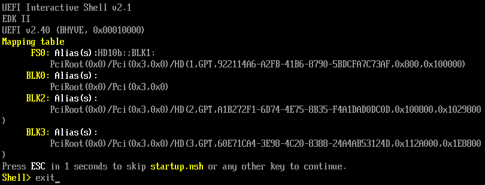
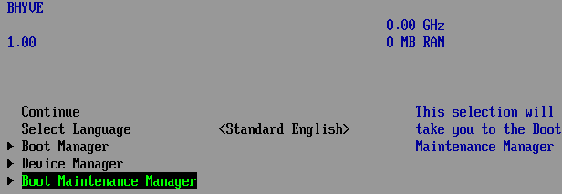
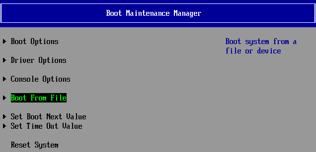
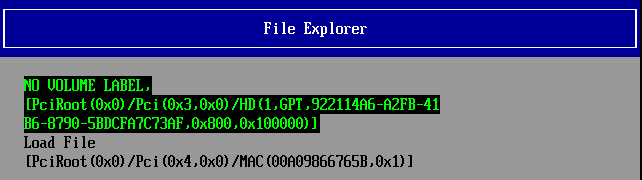
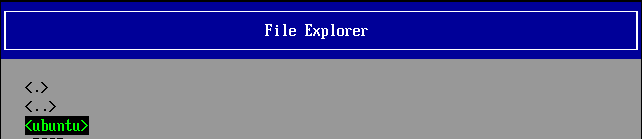
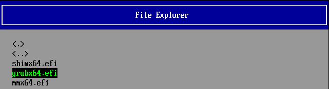

## These notes are for creating Ubuntu 16.04 LTS VM on top of FreeBSD/FreeNAS bhyve
Tested on FreeNAS 11.2/11.3

----

## Virtual CPUs

Ubuntu recommends 2+

## Memory Size

Ubuntu recommends 2GB+

## Boot Method

UEFI

First boot might fail. In which case you will have to wait for the UEFI to timeout and boot it from a file manually like so:








Once at the console do the following
```bash
sudo mkdir -p /boot/efi/EFI/BOOT/
cp /boot/efi/EFI/ubuntu/grubx64.efi /boot/efi/EFI/BOOT/bootx64.efi
```

## Network

VirtIO

I had trouble with my OpenWRT dnsmasq setting up Ubuntu default gateway at one point. (sudo route add default gw x.x.x.x)

## Disk

Ubuntu recommends 25GB

Sparse Zvol in either VirtIO or AHCI mode. VirtIO should work better. Default sector size since my pool is already running 4k sectors

## VNC / Serial

I typically use VNC with set resolution of 1024x768
